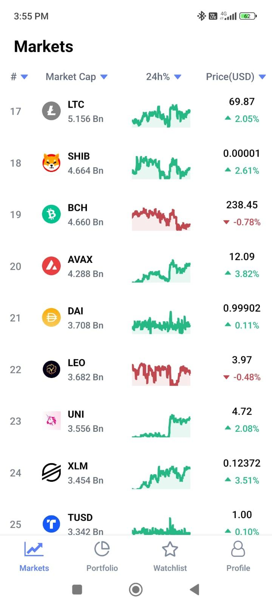

# Crypto Predictor App

Crypto Predictor App is a cross-platform mobile application built using React Native, Recoil, JavaScript, Firebase, and Context API. It provides real-time tracking and price predictions for various cryptocurrencies, complete with detailed charts. This full-stack application is designed to work on both Android and iOS devices.

## Key Features

- **Cross-Platform Compatibility**: Runs on both Android and iOS.
- **User Authentication**: Secure login and registration.
- **Real-Time Data**: Track cryptocurrency prices in real-time.
- **Predictive Analysis**: Price predictions using advanced algorithms.
- **Detailed Charts**: Visualize data with various chart options.
- **State Management**: Efficient state management with Recoil.
- **Firebase Integration**: Real-time database and authentication with Firebase.

## Screenshots





## Installation

1. **Clone the repository**:
   ```bash
   git clone https://github.com/Md-Mursaleen/Crypto-Predictor-App.git
2. **Navigate to the project directory**:
   ```bash
   cd Crypto-Predictor-App
3. **Install dependencies**:
   ```bash
   npm install
4. **Set up Firebase**:
   Create a new Firebase project.
   Add your Firebase configuration to firebaseConfig.js.
5. **Start the application**:
   ```bash
   npm start

 ## Usage

1. **Sign Up / Login**: Create an account or log in.
2. **Track Prices**: View real-time prices of various cryptocurrencies.
3. **Predict Prices**: Get predictive analysis of future prices.
4. **Visualize Data**: Use charts to visualize historical and predicted data.
5. **Manage Profile**: Update profile information and view history.  
